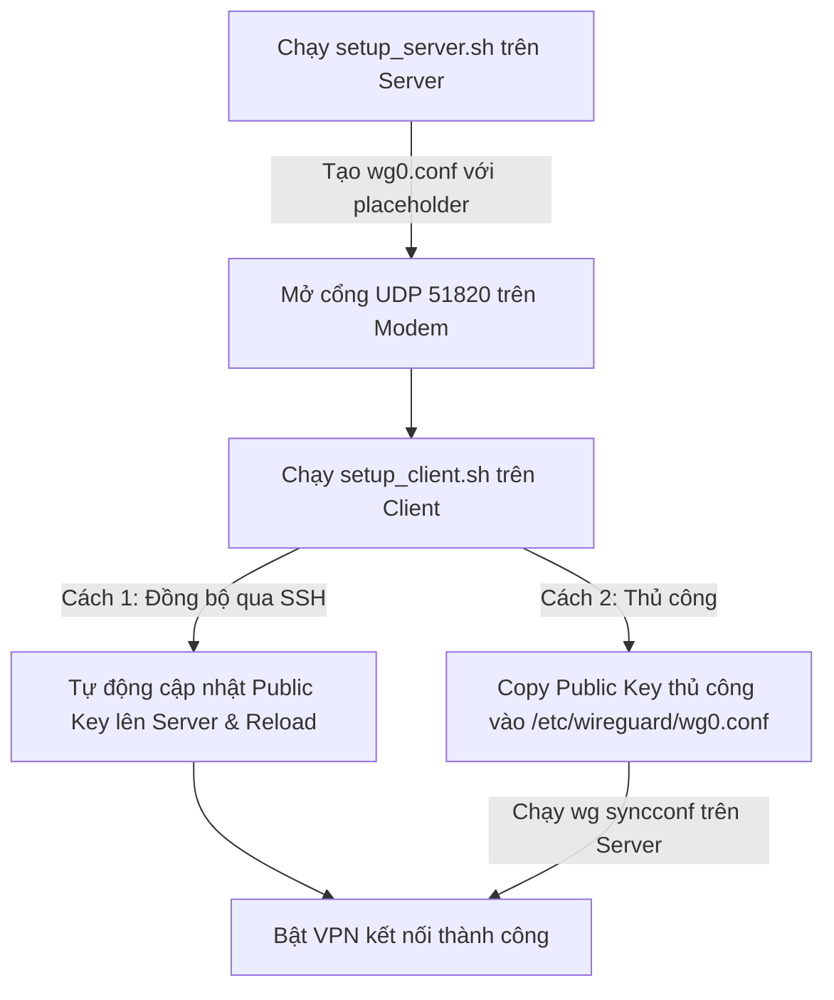

# Hướng dẫn thiết lập WireGuard Client-to-Site

Tài liệu này hướng dẫn chi tiết cách cài đặt, cấu hình và quản lý kết nối VPN WireGuard "Client-to-Site" sử dụng bộ công cụ tự động hóa gồm ba script: `setup_server.sh`, `setup_client.sh` và `uninstall.sh`.

---

## 1. Yêu cầu trước khi thiết lập (Prerequisites)

### Bước A: Cài đặt WireGuard trên cả Server và Client

* **Ubuntu / Debian:**
  ```bash
  sudo apt update && sudo apt install -y wireguard curl
  ```
* **CentOS / RHEL / Rocky Linux:**
  ```bash
  sudo dnf install -y epel-release
  sudo dnf install -y wireguard-tools curl
  ```

### Bước B: Cấp quyền thực thi cho các script
Tải bộ script về máy và chạy lệnh sau trong thư mục chứa script trên cả 2 máy:
```bash
chmod +x setup_server.sh setup_client.sh uninstall.sh
```

---

## 2. Quy trình thiết lập chi tiết



### Bước 1: Cấu hình trên máy chủ (Server)

1. Chạy script cài đặt máy chủ:
   ```bash
   ./setup_server.sh
   ```

   **Kết quả sau khi chạy thành công:**
   - Sinh cặp khóa cho máy chủ (`server_private.key`, `server_public.key`).
   - Tạo file cấu hình máy chủ tại `/etc/wireguard/wg0.conf` với block `[Peer]` được cấu hình sẵn cho `Client1 EdgeNode` (IP `10.8.0.2/32`), khóa công khai tạm thời để dạng placeholder.
   - Tự động nạp cấu hình và khởi chạy dịch vụ WireGuard trên máy chủ bằng quyền `sudo`.
   - Hiển thị thông tin **Server Public Key** lên màn hình. Hãy lưu lại thông tin này để cấu hình cho máy khách ở bước sau.

2. **Cấu hình NAT/Port Forwarding trên Modem/Router nhà mạng:**
   - Truy cập trang quản trị Modem/Router của bạn.
   - Forward cổng **UDP 51820** trỏ về địa chỉ IP LAN nội bộ của máy chủ (ví dụ: `192.168.1.100`).

---

### Bước 2: Cấu hình trên máy khách (Client) & Đồng bộ khóa

Chạy script cài đặt máy khách trên máy Client. Cú pháp chạy lệnh đầy đủ như sau:

```bash
./setup_client.sh <SERVER_PUBLIC_IP_OR_DOMAIN> <SERVER_PUBLIC_KEY> [SSH_USER] [SSH_PORT]
```

* **`<SERVER_PUBLIC_IP_OR_DOMAIN>`**: IP WAN công khai hoặc tên miền DDNS trỏ về Modem của Server.
* **`<SERVER_PUBLIC_KEY>`**: Khóa công khai của Server (in ra ở Bước 1).
* **`[SSH_USER]`** (Tùy chọn): Tên đăng nhập SSH của Server để tự động trao đổi khóa.
* **`[SSH_PORT]`** (Tùy chọn, mặc định là 22): Cổng SSH của Server.

#### Trường hợp A: Đồng bộ khóa tự động qua SSH (Khuyên dùng)
Nếu bạn cung cấp thông tin SSH của Server khi chạy lệnh, script sẽ tự động ghi khóa công khai thực tế của client vào file cấu hình trên máy chủ và tải lại dịch vụ:
```bash
./setup_client.sh 203.0.113.5 abcdef1234567890... hiengyen 22
```

#### Trường hợp B: Đăng ký khóa thủ công (Khi không dùng SSH)
Nếu bạn chạy lệnh không có tham số SSH hoặc việc kết nối SSH không thành công:
```bash
./setup_client.sh 203.0.113.5 abcdef1234567890...
```
Script sẽ sinh khóa, tạo tệp cấu hình client, khởi chạy dịch vụ client, và in ra mã khóa công khai của client. Bạn cần cập nhật khóa này lên máy chủ theo hướng dẫn ở **Bước 3**.

---

### Bước 3: Đăng ký khóa thủ công trên Server (Nếu thực hiện theo Trường hợp B)

1. Trên máy chủ (Server), mở tệp cấu hình WireGuard để chỉnh sửa:
   ```bash
   sudo nano /etc/wireguard/wg0.conf
   ```
2. Tìm đến block cấu hình `[Peer]` của `Client1 EdgeNode` và cập nhật khóa công khai của client vừa tạo vào phần `PublicKey`:
   ```ini
   [Peer]
   # Client1  EdgeNode
   PublicKey  = <DÁN_KHÓA_CÔNG_KHAI_CỦA_CLIENT_VÀO_ĐÂY>
   AllowedIPs = 10.8.0.2/32
   ```
3. Lưu lại tệp cấu hình và chạy lệnh sau trên máy chủ để áp dụng cài đặt mới mà không làm gián đoạn kết nối hiện tại:
   ```bash
   sudo wg syncconf wg0 <(sudo wg-quick strip wg0)
   ```

---

## 3. Quản lý dịch vụ & Kiểm tra kết nối

### Kiểm tra trạng thái kết nối
* **Trên cả Server và Client:**
  ```bash
  sudo wg show
  ```
* **Kiểm tra ping từ máy khách về máy chủ:**
  ```bash
  ping -c 4 10.8.0.1
  ```

### Điều khiển dịch vụ thủ công

* **Bật/Tắt kết nối trên máy chủ (Server):**
  ```bash
  # Tắt kết nối
  sudo wg-quick down wg0
  
  # Bật kết nối
  sudo wg-quick up wg0
  ```

* **Bật/Tắt kết nối trên máy khách (Client):**
  ```bash
  # Tắt kết nối
  sudo wg-quick down client_wg0
  
  # Bật kết nối
  sudo wg-quick up client_wg0
  ```

---

## 4. Gỡ bỏ hoàn toàn cấu hình (Uninstall)

Khi không còn nhu cầu sử dụng, bạn có thể dọn dẹp sạch sẽ dịch vụ WireGuard bằng script `uninstall.sh`. Chạy lệnh sau trên máy chủ hoặc máy khách để gỡ cài đặt:

```bash
./uninstall.sh
```

**Các tác vụ script này thực hiện:**
- Tự động dừng giao diện mạng Wireguard đang hoạt động (`wg0` hoặc `client_wg0`).
- Xóa bỏ các tệp cấu hình tương ứng trong `/etc/wireguard/`.
- Xóa bỏ các tệp khóa (`.key`) và tệp cấu hình nháp được tạo ra trong thư mục cài đặt hiện hành.
